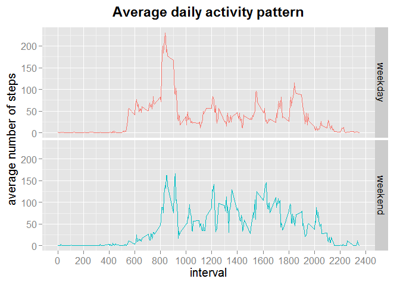

# Reproducible Research: Peer Assessment 1
  
### Loading and preprocessing the data
**Loading the libraries**  
The first part of this assignment is to load the appropriate libraries. Also, since I live in a country where the native language is not english, it is important to change local settings to support english terms (example: to ensure that function 'weekdays' returns values in english).

```r
library("lubridate")
library("ggplot2")
library("dplyr")
```

```
## 
## Attaching package: 'dplyr'
## 
## The following objects are masked from 'package:lubridate':
## 
##     intersect, setdiff, union
## 
## The following object is masked from 'package:stats':
## 
##     filter
## 
## The following objects are masked from 'package:base':
## 
##     intersect, setdiff, setequal, union
```

```r
Sys.setlocale('LC_TIME',"C")
```

```
## [1] "C"
```

**Unzipping file and preprocessing the data**  
The next step is to unzip the file containing the data, and reading it into R. It is important to note that the zip file was already copied in the working directory. The variable containing date information in converted to POSIXlt class.

```r
unzip('activity.zip')
data <- read.csv('activity.csv', na.strings = "NA")
data$date <- ymd(data$date)
head(data)
```

```
##   steps       date interval
## 1    NA 2012-10-01        0
## 2    NA 2012-10-01        5
## 3    NA 2012-10-01       10
## 4    NA 2012-10-01       15
## 5    NA 2012-10-01       20
## 6    NA 2012-10-01       25
```

### What is mean total number of steps taken per day?
**Preparing the data**  
To answer this question, a new data frame is created, using dplyr package functions. Data is grouped by date, and summarized as the total sum of steps for each day. 

```r
steps_per_day <- group_by(data,date) %>% summarize('total_steps' = sum(steps))
head(steps_per_day)
```

```
## Source: local data frame [6 x 2]
## 
##         date total_steps
## 1 2012-10-01          NA
## 2 2012-10-02         126
## 3 2012-10-03       11352
## 4 2012-10-04       12116
## 5 2012-10-05       13294
## 6 2012-10-06       15420
```

**Making the plot**  
After the number of total steps for each day is calculated, a **histogram** can be constructed using the following code:

```r
plot <- ggplot(steps_per_day, aes(x = total_steps)) +
        geom_histogram(colour = "black", fill = "white", binwidth = 3000) +
        geom_vline(aes(xintercept = median(total_steps, na.rm=T)), color = "red", size = 1) +
        labs(title = "Histogram of total steps per day", y = "frequency", x = "total steps per day") +
        scale_x_continuous(breaks = seq(0,24000,3000), labels = seq(0,24000,3000)) +
        scale_y_continuous(breaks = seq(0,20,2)) +
        theme(plot.title = element_text(size = 17, face = "bold", vjust = 2)) +
        theme(axis.title.y = element_text(size = 15, vjust = 1)) +
        theme(axis.title.x = element_text(size = 15)) +
        theme(axis.text = element_text(size = 13))
plot
```

 
  
Note that the days that do not have any measurements are not considered in this histogram.  
  
**Exploring the data**  
The **mean** and **median** number of steps taken per day can be calculated using:

```r
mn <- mean(steps_per_day$total_steps, na.rm = T)
mn
```

```
## [1] 10766.19
```

```r
mdn <- median(steps_per_day$total_steps, na.rm = T)
mdn
```

```
## [1] 10765
```
Note that the missing values were not considered to calculate the mean (10766.19) and the median (10765). The median is also despicted in the above histogram (as a red line).
  
### What is the average daily activity pattern?
**Preparing the data**  
To answer this question, a new data frame is created, using dplyr package functions. Data is grouped by interval (in the data set, a day is divided in 288 5-minute interval), and summarized as the mean number of steps for all days in the data set.

```r
steps_per_interval <- group_by(data,interval) %>% summarize('mean_steps' = mean(steps, na.rm = T))
head(steps_per_interval)
```

```
## Source: local data frame [6 x 2]
## 
##   interval mean_steps
## 1        0  1.7169811
## 2        5  0.3396226
## 3       10  0.1320755
## 4       15  0.1509434
## 5       20  0.0754717
## 6       25  2.0943396
```
  
**Making the plot**  
After the mean number of steps for each 5-minute interval is calculated, a **time-series plot** can be constructed to display the average daily activity pattern. The code used is:

```r
plot <- ggplot(data = steps_per_interval, aes(x = interval, y = mean_steps)) +
        geom_line() +
        labs(title = "Average daily activity pattern", y = "average number of steps", x = "interval") +
        scale_x_continuous(breaks = seq(0,2400,200), labels = seq(0,2400,200)) +
        scale_y_continuous(breaks = seq(0,250,10)) +
        theme(plot.title = element_text(size = 17, face = "bold", vjust = 2)) +
        theme(axis.title.y = element_text(size = 15, vjust = 1)) +
        theme(axis.title.x = element_text(size = 15)) +
        theme(axis.text = element_text(size = 12))
plot
```

 
  
**Exploring the data**  
It is possible to determine the interval with the highest mean number of steps:

```r
maximo <- filter(steps_per_interval, mean_steps == max(steps_per_interval$mean_steps))
maximo
```

```
## Source: local data frame [1 x 2]
## 
##   interval mean_steps
## 1      835   206.1698
```
which reveals that the interval with the highest mean number of steps is 835 (i.e., 8:35 AM), with 206.17 steps (compare with the graph above).
  
### Imputing missing values
**Preparing the data**  
The first step of this part is to determine how many and where **missing values** (NA) are present in the data set: 

```r
miss_v <- colSums(is.na(data))
miss_v
```

```
##    steps     date interval 
##     2304        0        0
```
This indicates that NA are only present in the *steps* variable, and that there are 2304 missing values.  
To replace the NA values the strategy chosen was to use the **mean value for all days for a given 5-minute interval**. This is implemented by creating a new variable, appending it to the original data frame as a new variable and storing the new data set in a new data frame:

```r
data_complete <- mutate(data, replaced_steps = replace(data$steps, is.na(data$steps), steps_per_interval$mean_steps))
head(data_complete)
```

```
##   steps       date interval replaced_steps
## 1    NA 2012-10-01        0      1.7169811
## 2    NA 2012-10-01        5      0.3396226
## 3    NA 2012-10-01       10      0.1320755
## 4    NA 2012-10-01       15      0.1509434
## 5    NA 2012-10-01       20      0.0754717
## 6    NA 2012-10-01       25      2.0943396
```
Note that this works fine for this data set, because the missing values have a clear pattern: if a day present a missing value, then all values for that day are also missing. If the day has a measure, then no missing value is present.  
After the missing values are replaced, data is grouped by date and summarized as the total sum of steps for each day.

```r
steps_per_day_2 <- group_by(data_complete,date) %>% summarize('total_steps' = sum(replaced_steps))
head(steps_per_day_2)
```

```
## Source: local data frame [6 x 2]
## 
##         date total_steps
## 1 2012-10-01    10766.19
## 2 2012-10-02      126.00
## 3 2012-10-03    11352.00
## 4 2012-10-04    12116.00
## 5 2012-10-05    13294.00
## 6 2012-10-06    15420.00
```

**Making the plot**  
After the number of total steps for each day is calculated, a **histogram** can be constructed using the following code:

```r
plot <- ggplot(steps_per_day_2, aes(x=total_steps)) +
        geom_histogram(colour = "black", fill = "white", binwidth = 3000) +
        geom_vline(aes(xintercept = median(total_steps, na.rm=T)), color = "red", size = 1) +
        labs(title = "Histogram of total steps per day (NAs replaced)", y = "frequency", x = "total steps per day") +
        scale_x_continuous(breaks = seq(0,24000,3000), labels = seq(0,24000,3000)) +
        scale_y_continuous(breaks = seq(0,27,2)) +
        theme(plot.title = element_text(size = 17, face = "bold", vjust = 2)) +
        theme(axis.text = element_text(size = 13)) +
        theme(axis.title.y = element_text(size = 15, vjust = 1)) +
        theme(axis.title.x = element_text(size = 15))
plot
```

 
  
**Exploring the data**  
The **mean** and **median** number of steps taken per day can be calculated using:

```r
mn2 <- mean(steps_per_day_2$total_steps, na.rm = T)
mn2
```

```
## [1] 10766.19
```

```r
mdn2 <- median(steps_per_day_2$total_steps, na.rm = T)
mdn2
```

```
## [1] 10766.19
```
The median is despicted in the above histogram (as a red line).  
Note that for this case, the mean (10766.19) and the median (10766.19) with NAs replaced are virtually the same as the mean (10766.19) and the median (10765) calculated ignoring the missing values (see above).
  
### Are there differences in activity patterns between weekdays and weekends?
**Preparing the data**  
To answer this question, a new variable is created to store the weekday for each row. Afterwards, another variable is created to determine with the day is a *weekday* or *weekend*.

```r
data_complete$weekday <- weekdays(data_complete$date, abbreviate = T)
data_complete <- mutate(data_complete, day_type = ifelse(weekday == 'Sat' | weekday == 'Sun','weekend','weekday'))
head(data_complete)
```

```
##   steps       date interval replaced_steps weekday day_type
## 1    NA 2012-10-01        0      1.7169811     Mon  weekday
## 2    NA 2012-10-01        5      0.3396226     Mon  weekday
## 3    NA 2012-10-01       10      0.1320755     Mon  weekday
## 4    NA 2012-10-01       15      0.1509434     Mon  weekday
## 5    NA 2012-10-01       20      0.0754717     Mon  weekday
## 6    NA 2012-10-01       25      2.0943396     Mon  weekday
```

Data is grouped by day type and interval, and summarized as the mean number of steps for all days in each subset.

```r
steps_per_interval_2 <- group_by(data_complete,day_type,interval) %>% summarize('mean_steps' = mean(replaced_steps))
head(steps_per_interval_2)
```

```
## Source: local data frame [6 x 3]
## Groups: day_type
## 
##   day_type interval mean_steps
## 1  weekday        0 2.25115304
## 2  weekday        5 0.44528302
## 3  weekday       10 0.17316562
## 4  weekday       15 0.19790356
## 5  weekday       20 0.09895178
## 6  weekday       25 1.59035639
```
  
**Making the plot**  
After the mean number of steps for each 5-minute interval is calculated, a **time-series plot** can be constructed to display the average daily activity pattern (for each type of day). The code used is:

```r
plot <- ggplot(data = steps_per_interval_2, aes(x = interval, y = mean_steps, colour = day_type)) +
        geom_line() +
        facet_grid(day_type ~ .) +
        labs(title = "Average daily activity pattern", y = "average number of steps", x = "interval") +
        scale_x_continuous(breaks = seq(0,2400,200), labels = seq(0,2400,200)) +
        theme(legend.position = 'none') +
        theme(strip.text.y = element_text(size=13)) +
        theme(plot.title = element_text(size = 17, face = "bold", vjust = 2)) +
        theme(axis.text = element_text(size = 12)) +
        theme(axis.title.y = element_text(size = 15, vjust = 1)) +
        theme(axis.title.x = element_text(size = 15))
plot
```

 
  
Plotting both lines on the same graph can help to observe some patterns, for example:

* in weekdays activity between 5-8 AM (5:00 to 8:00) is more intense;
* both weekdays and weekends present the highest activity in the 8-9 AM (8:00 to 9:00), but these are more intense during weekdays;
* in average, weekends have more steps in the 10AM - 6PM period (10:00 to 18:00);


```r
plot <- ggplot(data = steps_per_interval_2, aes(x = interval, y = mean_steps, colour = day_type)) +
        geom_line() +
        labs(title = "Average daily activity pattern", y = "average number of steps", x = "interval") +
        scale_x_continuous(breaks = seq(0,2400,200), labels = seq(0,2400,200)) +
        theme(strip.text.y = element_text(size=13)) +
        theme(plot.title = element_text(size = 17, face = "bold", vjust = 2)) +
        theme(axis.text = element_text(size = 12)) +
        theme(axis.title.y = element_text(size = 15, vjust = 1)) +
        theme(axis.title.x = element_text(size = 15))
plot
```

 
